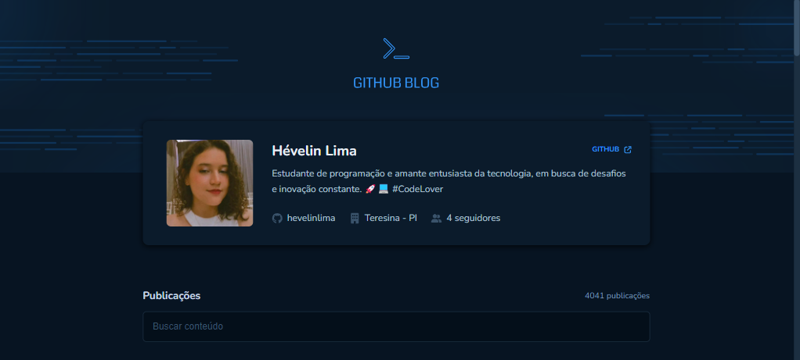

<h1 align="center"> Github Blog </h1>

 

  

  <em>Confira o resultado do app em: https://github-blog-hevelinlima.vercel.app//</em>

## 💻 Projeto

Github Blog é uma aplicação que utilizará da API do GitHub para buscar issues de um repositório, dados de perfil e exibir elas como um blog, que contém as seguintes funcionalidades:

- Listagem do seu perfil com imagem, número de seguidores, nome e outras informações disponíveis pela API do GitHub.
- Listar e filtrar todas as issues do repositório com um pequeno resumo do conteúdo dela
- Criar uma página para exibir um post (issue) completo

Para o desenvolvimento dessas funcionalidades, foram utilizados conceitos como:

- Estados
- ContextAPI
- Fetch / Axios
- Roteamento e React Router DOM
- Styled-components
- React Hook Forms

## 🚀 Tecnologias

Esse projeto foi desenvolvido com as seguintes tecnologias:

- HTML + CSS
- TypeScript + React
- Git e Github
- Vite
- Figma

---

Feito com ♥ by hevelinlima
